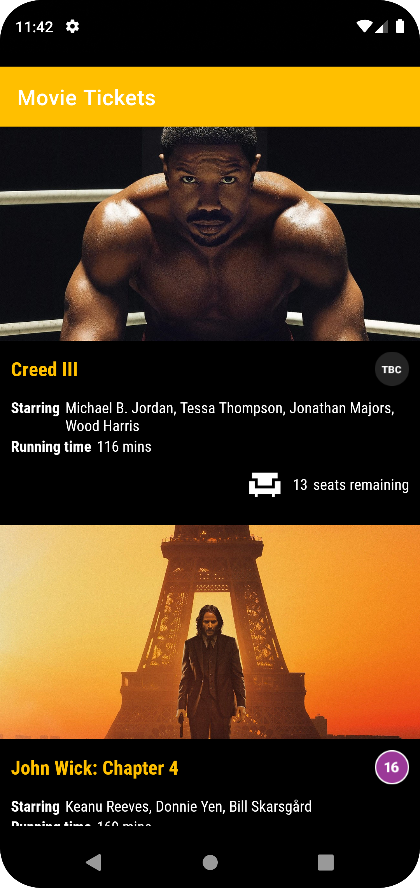
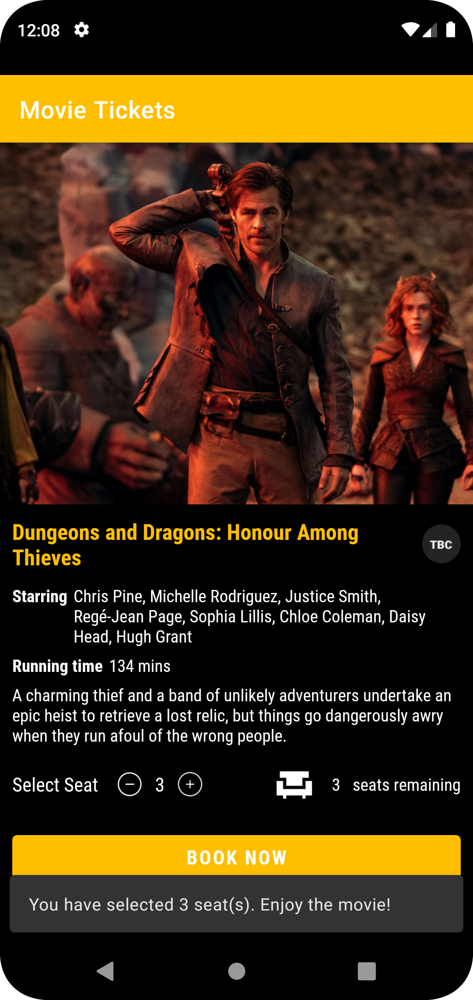

# movie_app

Mobile Apps 1 CA2  
Student Name: Joelma Rodrigues  
Student ID: 24130  
Course: Bsc in Computing  

## Requirement Checklist
- [x] 1. Movie recycler view:
  - [x] 1.1. Create a Movie class with the structure specified in movie.json (provided on Moodle)
  - [x] 1.2. Obtain and fill data (minimum of 4 movies)
    - [x] 1.2.1. Obtain relevant movie data from Vue (https://www.myvue.com/cinema/dublin/whats-on) or your favourite provider and add data credits at the bottom of the app
    - [x] 1.2.2. Generate a random number between 0 and 15 for each movie and assign to seats_remaining
    - [x] 1.2.3. Start with an initial default seats_selected value of 0 for all movies
    - [x] 1.2.4. You shall fill random URLs for images from pixabay or other free image providers to begin with
  - [x] 1.3. Build a Recycler View using the specified template, refer to recycler_view_template_*.jpg (provided on Moodle)
  - [ ] 1.4. If any seats are selected, show how many seats are selected and hide remaining seats
- [x] 2. Seat selection feature:
  - [x] 2.1. Clicking any item (anywhere on the item) on the movie recycler view should open a new MovieActivity, refer to movie_activity_*.jpg (provided on Moodle)
  - [x] 2.2. Add plus and minus icons, show seats_selected in the middle
  - [x] 2.3. On click plus/minus, update both seats_selected and seats_remaining for that movie
  - [x] 2.4. Add validation, when 0 seats selected minus is disabled, when 0 seats remaining plus is disabled
  - [ ] 2.5. When back is pressed, the selected seats are retained and reflected in the recycler view. (Hint: If you don’t see any updates, call adapter notifyItemChanged as soon as you return to the recycler view activity)
- [x] 3. Bonus:
  - [x] 3.1. Add "filling fast" badge if less than 3 seats remaining
  - [x] 3.2. Use "Roboto Condensed" font to replicate same style
  - [ ] 3.3. Use original movie images from myvue.com or your favourite provider (Hint: check get_movie_image_url.gif (provided on Moodle))

## Report
# Tickets Movie App

This is an Android app that allows users to browse and book movie tickets for their favorite movies.

## Features

- View a list of available movies
- View movie details including title, synopsis, cast, and running time 
- Book movie tickets by selecting a movie and seats  
- Toast messages for seat selection validation and successful booking  
- Roboto Condensed font used
- Clickable movie posters and Book Now buttons  

## References and Credits
Zoom Meetings: Ramachandran, S. (2023)  
Mobile App 1 - BSC20922 - Semester 2 [Zoom Meetings]  
Dorset College Dublin  

Github Repository: 
Ramachandran, S. (2023). Dorset MobileApps1  
Retrieved from https://github.com/saravanabalagi/dorset_mobileApps1

Image Source: https://www.rogerebert.com/reviews/
Content Source: https://www.myvue.com/
Icons: https://icons8.com/

- How to use Roboto in XML layout: https://stackoverflow.com/questions/34444616/how-to-use-roboto-in-xml-layout
- View.OnClickListener: https://developer.android.com/reference/android/view/View.OnClickListener
- OnClickListener interface: https://www.raywenderlich.com/5602-building-an-android-ui-with-kotlin-building-interaction
- onActivityResult: https://developer.android.com/reference/android/app/Activity#onActivityResult(int,%20int,%20android.content.Intent)
- Snackbar: https://developer.android.com/reference/com/google/android/material/snackbar/Snackbar
- Video Classes and Tutorials: 
  - https://www.youtube.com/watch?v=HtwDXRWjMcU
  - https://www.youtube.com/watch?v=J_onMnmgF5o&t=5882s  
  
## Screenshots

## Screenshots

<table>
  <tr>
    <td>
      
    </td>
    <td>
      
    </td>
  </tr>
  <tr>
    <td align="center"><b>Home Screen</b></td>
    <td align="center"><b>Movie Details Screen</b></td>
  </tr>
</table>

  
## APK Releases
Download the latest version [here](https://github.com/joelmarodrigues/movie_app/releases/tag/toast).

- Tickets Movie v1.1.0  

#Testing features
To watch a short video demonstrating the features of the app, click [here](https://youtube.com/shorts/6wkHrcQW0Gk?feature=share).

